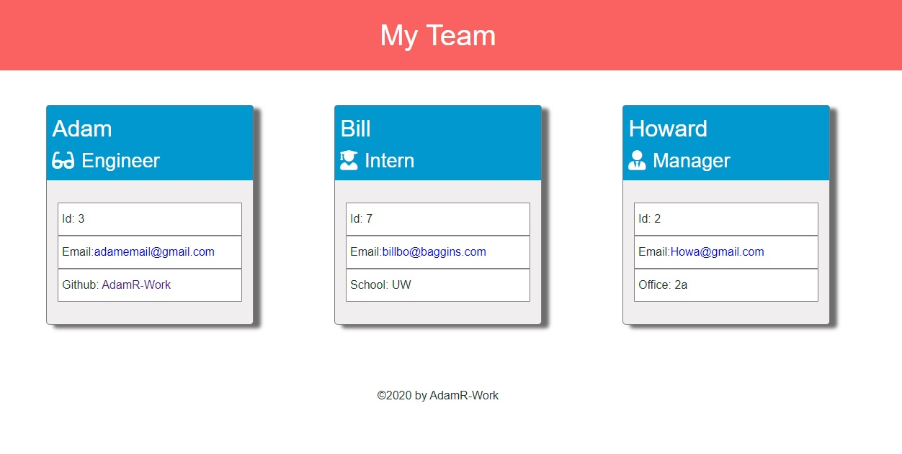
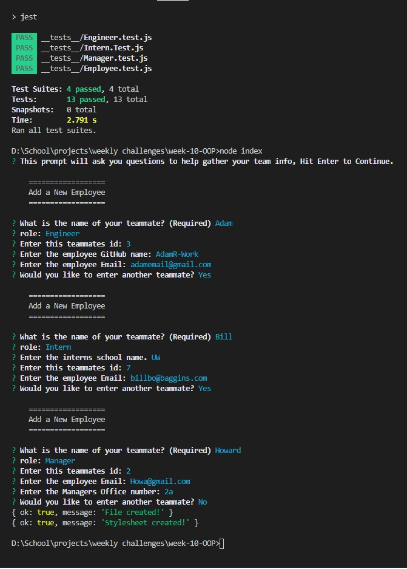

# Employee-Data-Gen

## License

No License Provided

## Table of Contents

 * [Installation](#installation)
 * [Usage](#usage)
 * [Credits](#credits)
 * [License](#license)
 
## Description

[Click this Link to see the App in use!!!](https://drive.google.com/file/d/111VBxNKlCYwVzq_fn2fx7NhFD9cl63GX/view "Employee-Data-Gen")

It generates a employee team html based off the users input with inquirer.

## Usage

Run the index.js from a prompt. then  answer the questions based on manager, intern, and engineer. It will then create a html and css in the dist folder.

## Installation

>npm install inquirer

## Languages

* node
* javascript
* html
* jest
* css

## Questions

### Email 

aramosatwork@hotmail.com

### Github

https://github.com/AdamR-Work/Employee-Data-Gen

## Contributing

## Tests

>npm install jest  
>npm test

## Credits

